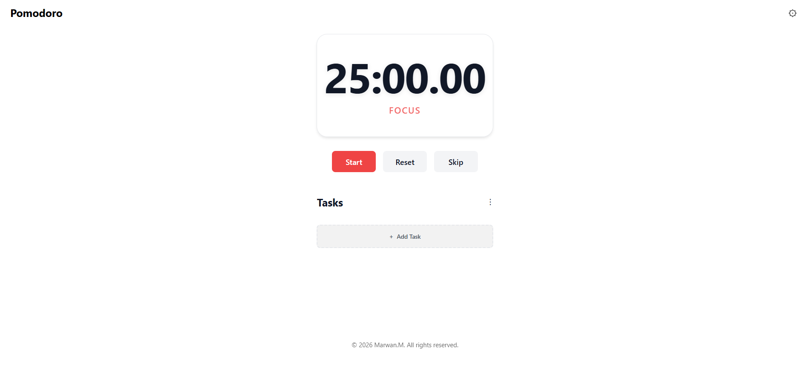

# 🍅 Pomodoro — Focus Timer

A modern **frontend-only** Pomodoro app built with **Vite + React** to help you stay focused, manage tasks, and track productivity — with **notifications & gentle sounds** and **no backend**.

  <a href="https://github.com/MaMohm/Pomodoro/stargazers">⭐ Stars</a> •
  <a href="https://github.com/MaMohm/Pomodoro/issues">🐛 Issues</a> •
  <a href="https://github.com/MaMohm/Pomodoro/blob/main/LICENSE">📄 License</a>

---

## 🚀 Live Demo
# Demo: ([mamohm.github.io/Pomodoro/](https://mamohm.github.io/Pomodoro/))

---

## ✨ Highlights

- ⏱️ **Drift-corrected timer** (more accurate than basic `setInterval`)
- 🔁 Focus / Short Break / Long Break sessions
- 🧠 Task list with Pomodoro estimates + progress tracking
- 🔔 Notifications (system notification + in-app toast) — **no backend**
- 🔊 Gentle sound alerts (focus-friendly)
- 💾 Local persistence (keeps data after refresh)
- 🎨 Clean, responsive UI (mobile + desktop)
- ⌨️ Keyboard-friendly controls

---

## 🖼️ Screenshots

> 

  

  

---

## 🧩 How It Works

**Pomodoro flow**
1. Focus session starts
2. On completion → notify + play sound
3. Switch to break
4. Long break after N focus sessions (configurable)

**Data**
- Everything is stored locally in the browser (no accounts, no server).

---

## 🛠️ Tech Stack

- ⚡ Vite
- ⚛️ React + TypeScript
- 🎨 CSS / UI components
- 🌐 Browser APIs: Notifications, Audio, Storage

> ✅ 100% client-side  
> ❌ No backend • ❌ No auth • ❌ No external services required
> 

src/
 ├─ components/      # Reusable UI components
 ├─ hooks/           # Custom React hooks
 ├─ utils/           # Helper functions (timer, notifications, etc.)
 ├─ styles/          # Global styles & themes
 ├─ App.tsx          # Main application component
 └─ main.tsx         # Entry point

 ### Made with love 😍 
